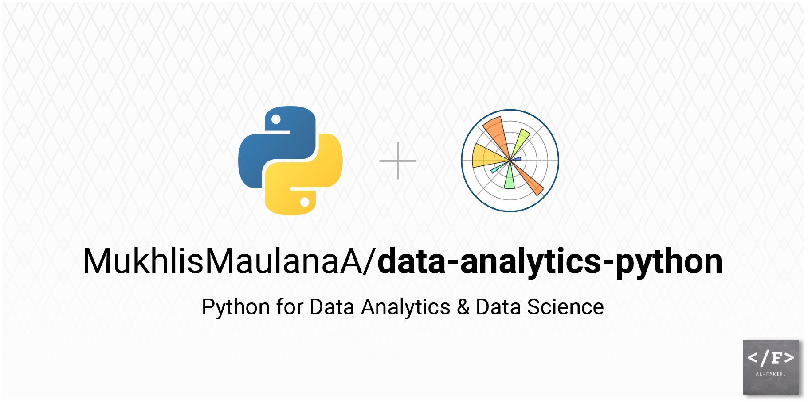

<h1 align="center">📊 Python for Data Analytics & Data Science</h2>



    

---

## 🧠 **Overview**

This repository provides a comprehensive guide to using Python for **Data Analytics** and **Data Science**. It is designed for both beginners and intermediate users to harness the power of Python's data-centric libraries, such as `NumPy`, `Pandas`, `Matplotlib`, and `Scikit-Learn`. By leveraging real-world datasets and problem-solving approaches, this project aims to cover the essential skills needed for **data analysis**, **statistical modeling**, and **machine learning** workflows.

The project is built around practical, project-based learning, with a focus on cleaning data, performing statistical analyses, visualizing insights, and building machine learning models.

---

## 📂 **Project Structure**

```bash
📦 Python-For-Data-Analytics-And-Data-Science
├── 📁 dateset/                         # Datasets used in the analysis
├── 📁 summary/                         # Results of analyze
├── 📁 visualizations/                  # Generated plots and charts
├── 📄 assignment.ipynb                 # Assignment RevoU Mini Course
├── 📄 banner-repo-github.png           # Banner for Repository
├── 📄 car-price.ipynb                  # Predict car price using ARIMA
├── 📄 data-cleansing.ipynb             # Clean data for Power BI Visualization
├── 📄 index.ipynb                      # First step Learning
├── 📄 market-basket-analysis.ipynb     # Market Basket Analysis
├── 📄 user-retention.ipynb             # User Retention using Cohort
├── 📄 user-segmentation.ipynb          # User Segmentation using RFM
├── 📄 README.md                        # Project documentation
└── 📄 LICENSE                          # License information
```

---

## 🚀 **Quick Start**

To quickly get started with this project, follow these steps:

1. **Clone the Repository**:

   ```bash
   git clone https://github.com/MukhlisMaulanaA/data-analytics-python.git
   cd data-analytics-python
   ```

2. **Create a Virtual Environment**:

   ```bash
   python3 -m venv venv
   source venv/bin/activate  # On Windows, use `venv\Scripts\activate`
   ```

3. **Install Required Dependencies**:

   Install all required packages using `pip`:

   ```bash
   pip install -r requirements.txt
   ```

4. **Run Jupyter Notebooks**:

   Launch Jupyter Lab to explore the interactive notebooks:

   ```bash
   jupyter lab
   ```

5. **Explore the Code**:

   Open any Jupyter notebook in the `notebooks/` directory and start experimenting with the code examples provided.

---

## 📊 **Core Technologies & Libraries**

This project utilizes a variety of powerful Python libraries that are staples in the Data Science community:

| **Library**       | **Description**                                                                 |
|-------------------|---------------------------------------------------------------------------------|
| `NumPy`           | Provides support for large multi-dimensional arrays and matrices of numeric data |
| `Pandas`          | High-level data manipulation tool, built on top of NumPy                         |
| `Matplotlib`      | 2D plotting library for creating static, animated, and interactive visualizations |
| `Seaborn`         | Statistical data visualization library based on Matplotlib                       |
| `Scikit-Learn`    | Machine learning library for classification, regression, and clustering           |
| `TensorFlow`      | Open-source platform for machine learning                                        |
| `SciPy`           | Library for scientific computing and technical computing                         |
| `Jupyter Notebook`| Open-source web application for creating and sharing documents with live code     |

---

## 📘 **Features**

- **Data Analysis & Wrangling**:
  - Cleaning, transforming, and preprocessing datasets using `Pandas` and `NumPy`.
  - Handling missing data, outliers, and various data manipulation techniques.
  
- **Data Visualization**:
  - Creating insightful plots and charts using `Matplotlib` and `Seaborn`.
  - Techniques for visualizing trends, distributions, and correlations.

- **Statistical Analysis**:
  - Performing exploratory data analysis (EDA) and descriptive statistics.
  - Hypothesis testing, probability distributions, and statistical inference using `SciPy`.

- **Machine Learning**:
  - Building predictive models using `Scikit-Learn` and `TensorFlow`.
  - Supervised learning (Regression, Classification) and Unsupervised learning (Clustering, Dimensionality Reduction).
  - Model evaluation techniques, including cross-validation, ROC curves, and precision-recall metrics.

- **End-to-End Workflow**:
  - A complete project pipeline from data acquisition and cleaning to model building and evaluation.
  - Example projects using real-world datasets.

---

## 📊 **Example Projects**

This repository includes hands-on projects that demonstrate the application of data analytics and machine learning:

1. **Customer Segmentation with RFM Segmentation**:
   - Goal: Segment customers into distinct groups based on purchasing behavior.
   - Dataset: [Online Retail Dataset](https://www.kaggle.com/datasets/vijayuv/onlineretail)
   - Techniques: Data pre-processing, RFM Segmentation, and result visualization.

2. **Predicting Cars Prices with ARIMA Time Series**:
   - Goal: Predict house prices based on various factors.
   - Dataset: [Cars Price](https://www.kaggle.com/datasets/CooperUnion/cardataset)
   - Techniques: Linear regression, ARIMA Time Series, and performance evaluation.

3. **Market Basket Analysis**:
   - Goal: Show requently purchased products with other products
   - Dataset: [Telecom Customer Churn Dataset](https://www.kaggle.com/blastchar/telco-customer-churn)
   - Techniques: Apriori Algorithm

---

## 🧑‍💻 **How to Contribute**

Contributions are welcome! If you would like to contribute to this project, please follow the steps below:

1. Fork this repository.
2. Create a new branch (`git checkout -b feature/your-feature`).
3. Commit your changes (`git commit -am 'Add new feature'`).
4. Push to the branch (`git push origin feature/your-feature`).
5. Create a new Pull Request.

For major changes, please open an issue first to discuss what you would like to change.

---

## 🛠️ **Future Improvements**

The following improvements and features are planned for future releases:

- Adding more datasets and advanced ML algorithms (e.g., XGBoost, LightGBM).
- Building dashboards with `Dash` or `Streamlit` for interactive data visualization.
- Introducing deep learning techniques with `TensorFlow` and `Keras`.

---

## 📝 **License**

This project is licensed under the MIT License. See the [LICENSE](LICENSE) file for more details.

---

## 📧 **Contact**

Feel free to reach out with any questions or feedback:

- **Email**: [mukhlis.maulanaalf@gmail.com](mailto:mukhlis.maulanaalf@gmail.com)
- **LinkedIn**: [Mukhlisalf](https://www.linkedin.com/in/mukhlisalf/)
- **GitHub**: [MukhlisMaulanaA](https://github.com/MukhlisMaulanaA)

---

## 🌟 **Acknowledgements**

Special thanks to all the open-source contributors and the data science community for providing inspiration and resources.

---

By following this project, you'll build a strong foundation in **Python for Data Analytics and Data Science**. We hope this project enhances your skills and helps you land your dream job in data science!

---

Feel free to adjust any project-specific details or update the content to align with your actual repository or datasets.
